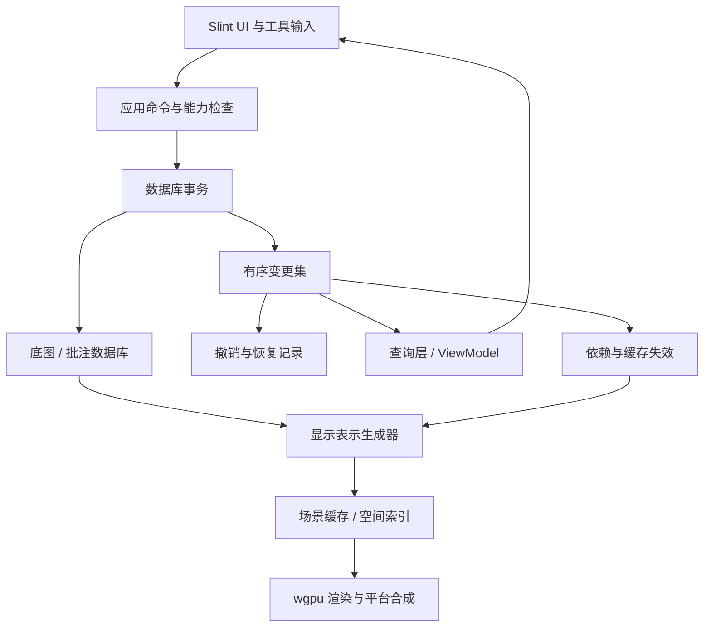

# Rust 工业 CAD 查看、测量与批注系统：实现执行规范

文档版本：2.0  
编制日期：2026-10-01  
适用对象：AI coding agent、系统开发者、测试与验收人员  
交付性质：需求、架构、实现约束与验收规范，不包含排期、工期或进度计划。

## 1. 文档使用规则

本文中的“必须”是实现和验收约束；“建议”是可通过实验调整的默认设计；“待验证”表示尚不能作为事实依赖的技术假设。用户已确认的约束优先于建议。发现框架能力与本文假设不符时，应记录证据和替代设计，不得静默删减需求或换用另一套技术栈。

本规范基于当前对话需求及官方文档核查编写，没有运行真实图纸或平台集成原型。已查阅 OpenCADStudio 的项目说明、Cargo.toml 和 tessellation 文档，尚未逐文件审计、编译或抽取其核心。文中的性能阈值属于建议验收预算，不是已有测试结果。源码与文档以最终锁定的依赖版本为准。

## 2. 产品目标与边界

### 2.1 已确认的技术和产品决策

1. 核心语言 Rust；DWG 解析使用 acadrust；CAD 绘制使用 wgpu。
2. 不修改 acadrust 上游源码，不维护修改版 fork，不用 Cargo patch 偷换为修改版本。所有补充处理位于自有 crate；允许评估未修改的正式版本升级。
3. UI 使用 Slint，复用 UI 定义、组件和应用状态；允许必要的平台宿主和浏览器 JS 接入。
4. 根据 2026-10-03 用户确认，新增 Linux App 为首要开发与验收宿主，Android APK 和浏览器应用继续交付、作为跨平台回归层。2026-10-04 用户调整默认提交门禁为 debug 编译与静态检查，不默认运行完整测试、Linux 离屏渲染或 release 编译。实际 Linux 运行验收仍须使用 `apps/app-linux` 的宿主/命令/数据库/共享 Slint/wgpu 链路，不以仅 UI 编译或测试替身代替；未运行须明确标注。无窗口可选验证使用软件 Vulkan/lavapipe；桌面窗口、真实 GPU、真实图纸分别记录验证范围。架构保留 iOS、macOS、Windows 宿主扩展能力，但不能将预留接口称为这些平台已验收。
5. Web 必须支持 WebGL2 与 WebGPU 两条 CAD 绘制路径，提供 Auto / WebGPU / WebGL2 选择。WebGL1 不属于要求。
6. 项目准备开源。以 OpenCADStudio 为绘制、几何离散、相机和 3D 能力的主要源码抽取/参考对象；不再从 JS 项目迁移绘制核心。mlightcad/cad-viewer 仅保留为 UI 功能组织及交互对照参考。
7. 保留 Slint，不随参考项目改用 Iced。以数据库对象、事务、变更集和显示表示为核心架构；业务层操作数据，不调用 GPU 绘制命令。
8. 产品包含极简查看模式及增强工作模式。初期增强模式仅包含测量、批注及其管理，不修改 DWG 原始图元。
9. 天正、探索者等自定义图元优先通过代理图形缓存显示；不能承诺无缓存或未知专有格式的完整兼容。

### 2.2 初期完成后应达到的成果

用户可在 Android 和浏览器本地打开合格样本范围内的 DWG，查看模型与受支持布局，操作图层，缩放平移、查询图元、完成测量和批注，并独立保存和恢复批注。遇到缺字体、缺外部参照、代理不完整或不支持的图元时，应用可继续查看其他内容，并准确提示缺失范围。

支持二维工作视图和三维观察视图：轨道旋转、标准视图、正交/透视切换，以及基础 3D 线面网格显示。ACIS 实体/曲面通过独立适配和离散模块接入，以公开能力表和样本验证范围为准，不承诺任意实体完整显示。

两端共享 CAD 数据库、事务、语义几何、显示表示、渲染、工具状态与 Slint UI 组件。Web 后端切换后，文档、相机和批注状态可恢复。大图运行有可复现性能数据、资源预算和可控降级行为，不以隐藏缺图或降低测量精度换取性能数字。

### 2.3 长期架构目标与非目标

长期目标是复用同一核心增加 iOS 和桌面宿主，支持多文档、多视口及独立工具扩展，允许将真正 CAD 编辑作为独立扩展接入。初期不实现 DWG 回写、原始实体移动/删除/修改、参数化建模、对所有 ACIS 曲面类型的完整兼容保证、三维建模命令、云协作、账号系统、AI 绘图、厂商 Object Enabler 跨平台运行或所有 CAD 格式兼容。

PDF/SVG 导出、DXF 导入、远程 URL 打开、离线安装/PWA、服务端预转换均作为可选扩展，不得挤占已确认功能，也不得默认为必需后端服务。

## 3. 功能需求

### 3.1 功能矩阵

| 编号 | 功能 | 极简查看 | 增强工作模式 | 说明 |
|---|---|---|---|---|
| F01 | 本地 DWG / DXF 打开、取消加载、错误恢复 | 必须 | 必须 | 默认不上传图纸；2026-10-03 用户追加 DXF 导入要求 |
| F02 | 平移、缩放、适应图纸、重置视图 | 必须 | 必须 | 鼠标、触控一致的空间行为 |
| F03 | 图层临时显隐、搜索、恢复 | 按需展开 | 必须 | 不修改 DWG 图层表 |
| F04 | 模型空间与受支持布局切换 | 必须 | 必须 | 不支持的视口状态显式报告 |
| F05 | 图元选择、高亮、基本属性 | 可配置入口 | 必须 | 不允许原图修改命令 |
| F06 | 距离、折线长度、角度、多边形面积 | 不展示工具 | 必须 | 单位、精度和几何来源可追踪 |
| F07 | 文本、引线、矩形/椭圆、自由线、云线批注 | 不创建 | 必须 | 查看模式可显示既有批注 |
| F08 | 批注选择、修改、删除、撤销/重做 | 不允许 | 必须 | 只影响批注层 |
| F09 | 批注列表、隐藏、导入/导出 | 只读显示可配置 | 必须 | 版本化独立格式 |
| F10 | 字体和附属资源管理、缺失提示 | 必须 | 必须 | 本地资源包，不自动发起任意网络请求 |
| F11 | 加载诊断、代理支持报告 | 简洁入口 | 必须 | 不静默漏图 |
| F12 | Web 后端选择及失败回退 | 设置入口 | 设置入口 | 后端重建不丢批注 |
| F13 | 2D/3D 切换、标准视图、轨道旋转 | 必须 | 必须 | 正交/透视，回到二维平面视图 |
| F14 | 3D 折线、面、网格的线框/着色显示 | 必须 | 必须 | 受支持几何可拾取；非完整隐藏线算法 |
| F15 | ACIS 实体/曲面网格显示 | 样本范围验收 | 样本范围验收 | 独立离散模块，失败或缺面可诊断 |

极简与增强模式共用一个文档会话。权限在命令执行层校验，不能只隐藏按钮。图层显隐、相机、选择属于会话状态，不使底图或批注变脏。增强模式中的“编辑”明确指批注编辑。

### 3.2 基础图形支持范围

必须建立实体能力表，分别列出读取、语义还原、绘制、拾取、测量的支持状态，不使用一个“支持”布尔值概括全部能力。

基础目标：LINE、LWPOLYLINE/POLYLINE（含 bulge）、CIRCLE、ARC、ELLIPSE、SPLINE、POINT、SOLID/TRACE、INSERT/块引用、TEXT/MTEXT、HATCH、常用 DIMENSION 可见表示。处理图层属性、ByLayer/ByBlock、嵌套块、OCS/WCS、线型比例、线宽、透明度及绘制顺序。

三维直接几何目标包含 3D 折线、3DFACE、PolyfaceMesh 和常见 Mesh 表示；ACIS 的 3DSOLID、BODY、REGION、SURFACE 分别建立样本与完整性结果。能旋转相机不等于能正确显示这些实体。

模型空间是主路径；纸空间支持基本布局、视口矩形裁剪、视图变换和比例。复杂视口裁剪、注释性缩放、动态块求值等必须按样本标记能力；不能把“读到结构”当作“完整显示”。外部参照与光栅图片建立资源解析接口，缺文件时说明来源，不能从不可信路径自动访问外部资源。

### 3.3 测量规则

- 内部几何与计算使用 f64。显式记录源单位、显示单位和转换比例；源单位未知时显示“图纸单位”，由用户指定单位或校准，不默认毫米。
- 距离/折线长度、三点角度、用户选点闭合多边形面积属于初期范围。自交多边形面积应拒绝或明确规定算法，不能给出含义不明的数字。
- 二维平面测量与三维两点空间距离分别建模，用户能识别结果含义。初期三维支持选点距离与三点角度；面积限定明确的共面闭合多边形，不实现体积或任意曲面面积。无法获得可靠深度时要求选择工作平面或有效几何，不用屏幕坐标猜测三维点。
- 纸空间测量区分纸面距离与视口内模型距离；没有正确实现视口反变换时禁用模型测量。
- 初期捕捉端点、中点、圆心及局部候选交点；捕捉容差以逻辑像素定义，再转换为世界坐标。
- 显示 LOD 不影响测量计算。代理缓存为折线近似时，结果标记为缓存几何测量，不声称原构件参数精度。
- 测量结果可作为批注保存，保留输入点、单位、算法类型、来源和精度等级，不只保存格式化字符串。

### 3.4 批注持久化

批注默认保存为独立的版本化 JSON（建议扩展名 .cadnotes.json），不写回 DWG。格式至少包含 schema_version、document_fingerprint、document_name_hint、unit_context、annotations、可选 view_bookmarks。

每个批注包含 UUID、类型、世界坐标几何、所属空间/布局、文本与样式、创建/修改时间、可选实体锚点及精度来源。实体锚点由源 handle、块实例路径、子几何标识和坐标回退组成；不能把易变 GPU 索引作为持久 ID。

图纸指纹基于原始内容强哈希，异步或分段计算；未完成前使用临时会话身份。指纹不匹配的批注导入必须提示并要求明确映射策略，不自动吸附到同名文件。schema 支持迁移；未知字段尽量保留或明确拒绝高版本。保存采用原子写入或等效事务；导出成功后才标记已保存。

浏览器本地恢复缓存与用户导出的文件分开定义：IndexedDB 缓存可能被清理，不能被描述为永久备份。Android 使用应用存储与系统文件接口，不能假设 content URI 是普通路径。

### 3.5 UI 与交互

宽屏查看模式采用大画布和少量浮动工具；宽屏增强模式采用分组工具栏、图层/属性侧栏、底部工具提示。手机使用大触控目标、底部工具分组和抽屉面板，不能直接缩小桌面 Ribbon。

初期不要求完整 AutoCAD 命令语言；共享 CommandId 和键盘快捷键即可。当前工具必须有明确提示、确认、取消和返回默认导航的路径。

定义输入状态机：Idle、Selecting、Measuring、Annotating、Panning 等状态；明确单指绘制与平移的优先级，多指导航不得意外提交批注。弹窗和输入框获取焦点后，画布快捷键暂停。支持 Esc/Android 返回取消当前工具，不能一次返回同时关闭工具和应用。

DPI、屏幕旋转、软键盘弹出、浏览器缩放及安全区域变化后，统一更新坐标映射。中文输入必须测试输入法组合输入，不能把尚未提交的拼音当作快捷键。UI 文案外置，以中文为默认并保留国际化结构。

## 4. 数据库驱动的系统架构

### 4.1 架构目标

业务层只操作领域数据、命令与事务。数据库提交成功后发布变更集，驱动 UI 查询、空间索引和显示缓存更新。GPU command submission 完全封装在渲染器内部，与数据库 transaction commit 不同。

数据库不知道 Slint、Iced、wgpu、Android 或浏览器。不能让 UI 属性变更直接修改 GPU buffer，也不能让实体持有永久 GPU 句柄。显示表示可丢弃并由数据库重建。



### 4.2 文档、会话、视口、工作区

| 对象 | 权威数据 | 不能放入的内容 |
|---|---|---|
| Document | 数据库、单位、资源引用、文件身份、revision | UI 控件、相机、GPU 设备 |
| Session | 当前工具、选择集、临时图层覆盖、活动空间 | 原始 DWG 的可变副本 |
| Viewport | 相机、投影、裁剪、显示样式、DPI、视口尺寸 | 独立复制的整个数据库 |
| Workspace | 文档和视口组织、面板布局 | CAD 几何算法 |

初期 UI 可以一次只展示一个文档和一个视口，但类型和接口必须携带 DocumentId、ViewportId，不能靠全局 singleton 表示唯一文档。相同底图可被多视口观察，基础几何共享，视口专属可见性/LOD/附件分开。

### 4.3 数据层划分

| 数据 | 初期访问规则 | 持久性 |
|---|---|---|
| DrawingDatabase | 受控导入完成后只读 | 来源 DWG 与必要规范化数据 |
| AnnotationDatabase | 必须经过事务修改 | 独立批注格式 |
| SessionState | 应用层操作，可有导航历史 | 可选恢复，不属于底图修改 |
| PreviewState | 工具频繁更新，不进文档撤销栈 | 临时，取消即丢弃 |
| DerivedCaches | 按版本重建 | 可删除，不是权威来源 |

未来底图编辑可增加写入能力，但不得为了预留而在初期暴露 unrestricted mutable access。导入器通过 Builder 构造数据库，应用通过查询接口只读访问；所有正式写入必须经过同一验证和变更追踪路径。

### 4.4 DB 对象和身份

DbObject 表示数据库对象的公共身份、类型和元数据。DbEntity 表示可位于空间中的几何对象；Layer、BlockDefinition、Layout、Style 等是被引用的数据对象。使用强类型 ObjectId/EntityId，避免把所有 ID 混成字符串或裸整数。

Rust 中建议采用稳定 ID + 显式数据类型/枚举 + 外部协议提供器，而非照搬庞大的继承树。对扩展类型预留 type key 与版本化 opaque payload；未知数据不能自动当作可绘制实体。

选择引用至少包含 DocumentId、EntityId、InstancePath 和可选 SubElementId。源 DWG handle 只是来源标识；块定义里的同一实体在不同 INSERT 中必须能区分。GPU 顶点索引、批次位置不能作为持久 ID。

对象删除后旧 ID 不得误指向新对象；可使用带 generation 的句柄或不复用的持久 ID。导入映射必须稳定记录 source handle。三维 face/edge 编号可能在重新离散或拓扑变化后失效，锚点应有稳定来源、坐标回退及 Valid/Stale/Unresolved 状态，不能声称自动解决拓扑命名问题。

### 4.5 模块规划

| 模块 | 责任 | 禁止事项 |
|---|---|---|
| cad-domain | ID、单位、语义几何、来源/精度类型 | 外部 UI/GPU 类型 |
| cad-db | 对象存储、查询、引用校验、事务、revision、ChangeSet | 直接渲染 |
| cad-import-acadrust | 读取和数据库 Builder 适配、导入报告 | 改 acadrust 源码 |
| cad-proxy | 公开代理缓存解析、状态回放 | 伪造缺失图形 |
| cad-kernel-adapter | ACIS/曲面到可离散几何的隔离接口 | 对外泄露内核对象 |
| cad-geometry | 曲线、坐标变换、几何运算、容差策略 | UI 数据绑定 |
| cad-representation | 实体显示协议、线/面/文字/实例表示 | 拥有 Surface 或事件循环 |
| cad-dependencies | 引用反向索引、依赖版本、失效传播 | 无界全图重算 |
| cad-spatial | 空间索引、实例查询、射线候选 | 只靠 GPU 同步读回 |
| cad-scene | 分块、批次、LOD、显示缓存和更新集 | 权威数据库修改 |
| cad-render-wgpu | 2D/3D 管线、buffer/texture、统计 | 解析文件或执行业务命令 |
| cad-resources | 字体、图片、外参解析契约及缓存 | 任意网络/路径访问 |
| cad-measure | 捕捉、测量、单位与精度报告 | 用屏幕图片反推尺寸 |
| cad-annotations | 批注实体、业务规则和命令 | 自建绕开 cad-db 的修改路径 |
| cad-history | 撤销重做、命令合并、恢复日志接口 | 重放鼠标输入代替恢复数据 |
| cad-app | Session/Workspace、命令、能力与工具状态 | 平台 API 穿透 |
| cad-query | 面板查询、ViewModel、增量更新 | 复制整个数据库给 UI |
| cad-ui-slint | 共用控件和响应式布局 | 每实体创建 Slint 图形元素 |
| cad-platform | 文件、任务、存储、生命周期与合成契约 | 平台具体实现 |
| app-android / app-web | 宿主装配、输入、系统接口与发布 | 复制 CAD 业务逻辑 |
| cad-diagnostics / cad-cli-tools | 报告、核心测试、基准和固定视口工具 | 生产 GUI 必需服务端 |

小模块可以物理合并，但不得反转依赖方向。通过 crate 依赖约束和编译验证，不只依赖注释。

### 4.6 事务与变更契约

事务步骤：创建写入上下文 → 累积修改 → 验证对象/引用/单位/权限 → 原子提交 → revision 递增 → 发布有序 ChangeSet。失败不留下部分状态。外部文件操作不得发生在数据库锁内；提交不等待几何离散、GPU 上传或保存完成。

ChangeSet 包含 DatabaseId、前后 revision、transaction ID、新增/更新/删除对象、变更原因及 change mask。mask 区分 Geometry、Style、Transform、References、Metadata。提交合并通知；十万个对象变化不产生十万个 UI 回调。

Style 变化不应默认重建曲线；Metadata 变化不应触发渲染；Transform 更新需要更新实例范围和拾取；Geometry 更新使对应离散与索引失效。订阅者漏事件或发现 revision 不连续时从数据库重建快照，不允许长期保持错误缓存。

初期使用单一受控写入者，后台任务消费只读快照/共享数据。避免在核心中引入复杂多写者事务；未来若增加协作需要新的冲突模型，不能把本地 ChangeSet 宣称为协作协议。

示意调用（自有 API，非第三方现有 API）：

```rust
let mut tx = session.begin_annotation_transaction("创建引线")?;
let id = tx.insert_annotation(annotation)?;
let change_set = tx.commit()?;
// 应用分发 change_set；业务调用者不创建 buffer 或调用 draw。
```

### 4.7 命令、工具、预览与撤销

Command 表达意图，Transaction 管数据一致性，UndoRecord 管数据恢复，ChangeSet 管下游通知，Journal 管可选异常恢复。不要把它们揉成一个命令对象。

工具状态机处理指针/键盘、多次选点、确认和取消。拖动阶段只改 PreviewState，确认时提交一次事务。撤销保存必要的 before/after 数据或等价可逆补丁，不依赖重新执行非确定性计算。撤销/重做同样发布 ChangeSet 并更新数据库 revision。

每个命令声明适用模式、目标数据库、参数校验、是否可撤销及合并规则。模式切换时处理未确认工具，不能悄悄提交。大型历史记录有内存预算及可选落盘策略，禁止无限保留全库副本。

### 4.8 显示表示协议

RepresentationProvider 根据只读 EntityView、资源/样式上下文和显示精度配置，输出 DisplayRepresentation 与完整性报告。提供器注册在应用组合根，按实体类型/能力匹配。输出线/曲线、网格、文字、图片、实例与来源映射，不输出 Slint 控件或直接 GPU 命令。

将基础语义几何、可复用离散等级与视口专属显示配置分离，避免每个视口复制全部几何。一个实体可以产生多个显示片段；多个实体可以合成一个 RenderBatch。片段必须保留 entity/instance/sub-element 来源以支持批处理后的拾取。

SolidTessellator 接收自有几何描述或明确的交换数据、容差与取消上下文，返回 Mesh、Edges、面映射、误差及完整性。内核具体 Body/Face 类型限制在适配模块。代理回放也是提供器之一，并非绕过数据库的特殊绘制通道。

### 4.9 UI 查询层

Slint 绑定 LayerListModel、SelectionPropertiesModel、AnnotationListModel、ToolStateModel 和 DiagnosticsModel。列表采用可分页/虚拟化查询与增量行更新，不为海量实体构建 UI 对象。多选属性显示 Mixed/Unset，不用空字符串混淆。

UI 发命令，查询层接收提交结果再更新模型。程序更新 ViewModel 不应反向触发同一命令。验证失败显示错误并保持数据库原值；不要让 UI 和数据库各保存一份无法同步的可写真相。

异步查询带 DocumentId、revision 和请求 ID；文档切换后丢弃旧结果。面板只查询所需字段，几何大数组不通过 UI 模型复制。

### 4.10 错误与异步一致性

错误分类为输入错误、能力缺失、资源缺失、数据损坏、GPU 故障及内部不变量失败。使用结构化 Result，不在外部数据路径随意 unwrap。局部实体失败可继续，但报告对象与原因。

后台结果带文档 generation、对象 revision、依赖版本和生成配置。只有仍匹配时发布；否则丢弃或重排任务。库调用不可中断时，取消至少阻止结果进入当前会话；不能谎称计算已立即停止。设备重建不改变数据库 revision。

## 5. Slint 与 wgpu 集成规范

### 5.1 已知事实与待验证项

Slint 有 wgpu 外部渲染集成，要求共享 Device/Queue，可通过纹理或绘制回调合成；接口带版本化 unstable-wgpu 特性。Slint 普通 Web 文档描述的是 Winit + FemtoVG + WebGL Canvas。Android 有官方宿主支持；iOS 文档描述 Winit + Skia。以上均不能推出“任意 Slint 后端都可直接接收任意 wgpu 纹理”。参见文末 S1–S5。

### 5.2 GPU 所有权

一个合成路径只设一个 Surface/呈现协调者。首选由 Slint 宿主提供可共享 GPU 环境，CAD 渲染到兼容纹理，Slint 合成。CAD 模块不自行创建第二套事件循环，不在同一个窗口表面上与 Slint 争抢 present。

必须明确并测试：wgpu 主版本、Device/Queue 身份、纹理 usage/格式、MSAA resolve、alpha 预乘、sRGB/线性色彩、提交先后顺序、尺寸变化、纹理生命周期与设备丢失。资源提交顺序不能依赖偶然回调顺序。

同为 Metal/Vulkan 并不保证跨引擎或跨设备纹理可直接共享。禁止用每帧 GPU→CPU→GPU 整幅回读作为正式 CAD 合成路径。

### 5.3 平台组合决策

| 平台 | 优先方案 | 必须验证 | 受阻时允许的方向 |
|---|---|---|---|
| Android | Slint 可用 wgpu 渲染器 + 同设备纹理 | Activity 后端接入、触控、Surface 销毁重建 | 独立平台合成桥；记录代价后再确定实现 |
| Web | 验证 Slint/wgpu 一体合成 | Wasm 编译、WebGL2/WebGPU 两条路径 | 两 Canvas 分区/叠放，仍复用 Slint UI |
| 桌面预留 | Winit + 共享 wgpu 组合 | DPI、多窗口策略、输入法 | 宿主适配，不改核心 |
| iOS 预留 | 验证可用共享组合 | Skia 默认路径与 wgpu 合成能力 | 独立原生合成适配，不宣称已支持 |

这些是设计候选，不是已经验收的组合。若需要重写 Slint 后端或大量原生互操作，必须输出架构决策记录，不能将其藏在通用渲染模块中。

Web 双 Canvas 方案必须解决透明背景、弹窗遮挡、命中路由、焦点、页面滚动、DPR 与几何同步。优先分区，只有确认透明合成和事件透传正常才使用全屏 UI 覆盖。不能让上层 Canvas 吞掉全部画布输入。双 Canvas 增加 GPU 上下文/内存成本，需测量。

## 6. 多后端能力体系

CAD 提供 Auto、WebGPU、WebGL2。Auto 根据初始化、features、limits 和测试结果选择，不仅检查 navigator.gpu 是否存在。明确显示实际激活后端；强制选择失败时报告原因并提供回退选项。

基础档以 WebGL2 可实现能力为边界：CPU 可见性与细分、批处理、能力允许范围内的实例化，不依赖 compute、storage buffer 或间接绘制。增强档可增加这些能力，但必须保留相同显示与测量语义。

CPU 场景描述与 GPU 资源分离；切换后重建管线、buffer、纹理、图集和能力相关批次。不能复用旧 Device 对象。允许重启渲染会话或刷新恢复，不要求无缝热切换；切换前保护未保存批注。

CAD 后端配置与 Slint 渲染配置分开记录。Vello 需要 compute，不作为 WebGL2 通用 UI 方案。浏览器初始化和文件保存等异步操作不能用阻塞等待占据 UI 线程。

设备丢失时暂停提交，尝试有界重建；无法恢复时提示重新加载并提供批注导出/恢复。不得无限重试或在失败循环中持续分配 GPU 资源。

## 7. DWG 导入、代理图元与资源

### 7.1 导入处理

导入顺序为读取字节、acadrust 解析、统一遍历普通实体与块/布局、代理补充处理、规范化、空间索引及几何构建、分批 GPU 上传。这是应用导入流程，不要求改动 acadrust 内部或假设它存在回调钩子。

实体属性解析必须有上下文：图层属性、块继承、可见性、嵌套变换、OCS 到世界坐标、布局和绘制顺序。块定义遍历与实例绘制分开，避免在文档遍历时把块内实体当成顶层对象再画一次。循环块引用有深度/循环检测。

### 7.2 代理图形方案

官方 0.5.5 文档暴露 EntityCommon.graphic_data、proxy_graphics()、ProxyGraphicRecord::Unknown { record_type, data } 和 UnknownEntity 原始 DWG 数据。当前类型化记录仅明确列出 FillOff、UnicodeText 和 Unknown，不可宣称代理几何已经完整解码（S7–S9）。

在 cad-proxy 中实现自有解码与回放器，消费公开数据：

1. 记录实体类名、应用名、handle、源版本、数据长度和来源。
2. 优先使用公开代理记录；对未解释 record_type 在自有 crate 中解码。
3. 内置解码失败但完整 graphic_data 可得时，允许自有完整缓存解析器。
4. raw_dwg_data 不是直接可播放的 graphic_data；若必须解析原始 DWG 记录，设独立模块并以样本验证，不能直接混用。
5. 若库丢弃数据或文件本身无缓存，输出明确缺失结果；不得伪造图形或静默消失。

回放器维护样式、填充、变换和格式要求的状态栈。支持记录以真实格式证据和样本为准，不凭空猜测 opcode。未知几何与未知状态指令分别处理：未知状态可能影响后续全部输出，此时需保守降级并标记不完整。

输出统一 GeometrySource 和完整性报告。普通图元已成功绘制时，不能再叠加代理缓存。代理结果缓存一次，进入普通空间索引、分块和批处理；禁止每条指令一个 draw call。

天正/探索者的有缓存、无缓存、仅包围盒、不同版本和不同实体类别都需要样本。PROXYGRAPHICS=1 只能在能生成图形的源环境重新保存时帮助形成缓存，本应用不能恢复不存在的信息。不能通过安装厂商 Windows Object Enabler 来承诺 Android/Web 通用支持。

### 7.3 字体、文字与外部资源

CAD 文字与 UI 文字是两条处理路径。CAD 文本保留字体名、字高、宽度因子、旋转、对齐、MTEXT 控制信息；字体替换需要诊断，不能只追求可读而忽略排版变化。

设计资源解析优先级：用户指定资源包、当前文档资源目录映射、应用可分发字体、明确的替代字体。检查 SHX/BigFont/TTF 的实际支持，不假定 Slint 文本可替代 CAD 字形。字体授权和分发条件需记录；不得捆绑来源不明字体。

资源引用使用逻辑 key，不在领域层存平台绝对路径。限制外参递归、图片解码尺寸和字体缓存。附属资源缺失可诊断并继续，不能自动访问任意本地路径或向外发送文件名。

## 8. 大图性能设计

### 8.1 必须从架构落实的优化

| 方向 | 规则 | 注意事项 |
|---|---|---|
| 空间索引 | 按可见区域过滤实体和实例，局部候选精确拾取 | 不逐帧全图扫描 |
| 分块批处理 | 空间块 × 图元管线 × 兼容样式组 | 不把全图同材质合成不可剔除大批次 |
| 块实例化 | 定义几何共享，插入保存变换/样式 | 处理 ByBlock、非均匀缩放及实例路径 |
| 静态缓冲 | 底图上传后复用，只更新必要参数 | 相机变化不重传全部顶点 |
| LOD | 按屏幕误差细分曲线，缓存离散等级 | 加滞回，避免滚轮时反复重建 |
| 文字与填充 | 字形布局、图集和复杂边界缓存 | 字体/样式是缓存键的一部分 |
| 按需重绘 | 无输入、动画、任务结果时不持续渲染 | 保证异步结果能唤醒画面 |
| 动静分离 | 底图、批注、临时预览分离 | 修改批注不重建底图 |
| 有界内存 | 缓存预算、队列背压、资源淘汰 | 超预算要解释降级而非崩溃 |

分块不能破坏原始绘制顺序、透明混合、遮罩和裁剪。超长线、大填充和大型插入应有单独策略，避免跨块复制引起数据膨胀。图层显隐可用批次/索引或能力支持的样式数据更新，不默认重生成全部几何。

### 8.2 精度与坐标

CPU 使用 f64，GPU 使用局部原点相对坐标的 f32。原点可按块或稳定空间区域确定，结合相机相对变换，避免平移时重写全图顶点。测试大坐标、小尺寸对象、极端缩放和嵌套变换。

线宽、连接和端帽使用可控几何或 shader，不依赖各后端不一致的宽线支持。线型相位与累计长度要跨分块连续。抗锯齿策略独立可配置，保证高 DPI 上逻辑线宽一致。

### 8.3 渐进构建与调度

首个可用画面优先显示简单可见几何，复杂文字/填充补齐时显示加载状态。几何分块生成与分批上传不等于 DWG 解析支持流式读取，必须分别统计。

按当前视口、邻近区域、后台区域安排任务。限制每帧 CPU 构建量和上传字节，提供取消与有界队列；任务结果通过文档/相机 generation 丢弃过时内容。不可每帧细粒度跨 Wasm/JS 调用或序列化全图。

Web Worker 与原生线程使用不同执行器实现。初期 Web 可在 Worker 解析并传递分块二进制数据；使用可转移 ArrayBuffer 减少复制，但必须测量 Wasm 内存出入复制，不能宣称自动零拷贝。SharedArrayBuffer/多线程 Wasm 作为可选能力，明确其部署隔离要求，提供无共享内存路径。

### 8.4 缓存策略

几何缓存键包含文档身份、实体/定义版本、样式、字体、细分等级和必要布局上下文。批注 SceneDelta 只使局部内容失效。

底图纹理缓存只在视图不变且收益可测时启用。导航中可暂时重投影旧图并尽快恢复矢量清晰度；不得将缓存图用于精确拾取。单张 4096×4096 RGBA8 纹理约 64 MiB，未含 MSAA 和其他附件，手机不应无预算分配多个大缓存。

内存预算分开记录文件/解析对象、领域模型、CPU 几何、GPU 估算、图集和渲染附件。浏览器无法可靠读取全部显存时应标记为应用估算，不能报告伪精确值。缓存淘汰后可恢复，不丢批注或文档语义。

### 8.5 增强优化的启用条件

GPU 剔除、compute 曲线生成、间接绘制、复杂瓦片缓存和高级压缩，只有在 profiling 指向具体瓶颈后引入。每项增强必须有能力检测、基础路径和对照基准。不能为了 WebGPU 分支删除 WebGL2 功能。

测量交点只计算局部候选，不预计算全图两两交点。GPU ID 拾取是可选优化，避免同步读回卡顿；CPU 空间索引必须能支撑基础交互。

## 9. 平台服务与发布工程

### 9.1 Android

通过系统文件选择器/SAF 读取 content URI，按权限规则保存与导出，避免申请不必要的全盘权限。处理暂停、恢复、旋转、低内存、进程重建和 Surface 重建。GPU 资源可重建，未保存批注有恢复机制。区分临时 URI 权限和可持久权限。

锁定 SDK/NDK、Rust target 和打包工具链；生成可安装 APK 并提供构建说明。开发签名与发布签名分开，密钥不进入仓库。最低系统版本和 GPU 支持范围依据最终 Slint/wgpu 组合实测确定并写入兼容表。

### 9.2 Web

交付静态可部署资源、Wasm 和最小 JS 宿主，记录 MIME、HTTPS、安全上下文及可选 COOP/COEP 配置。不要求后端处理 DWG。文件打开使用用户授权 File API；持久化采用可用浏览器 API，并保留下载导出路径。

WebGPU 和 WebGL2 初始化、错误回退、刷新恢复均测试。Web 应用在页面隐藏时暂停无必要绘制。支持目标浏览器矩阵需记录版本和设备；不能将桌面 Chrome 通过等同于移动 Safari 通过。无障碍受 Slint Canvas 路径限制，应明确边界，不宣称拥有 HTML 原生语义。

### 9.3 后续平台可扩展性

抽象 FileAccess、ResourceResolver、TaskExecutor、Persistence、Clipboard、HostLifecycle、RenderHost。接口采用领域数据与自有句柄，平台对象不穿透到 cad-domain。保留 desktop 和 ios 宿主装配位置，不创建无法编译的假实现来表示支持。

## 10. OpenCADStudio 核心抽取规范

### 10.1 依据与边界

主要来源为 https://github.com/HakanSeven12/OpenCADStudio 。当前已查阅 main 的 Cargo.toml：UI 使用 Iced，文件/几何相关依赖使用 opencadcodec、opencadkernel 和 opencadgraph。不能假设其类型与 acadrust 兼容，也不能声称已经存在可直接给 Slint 使用的独立 renderer crate。

项目准备开源。抽取代码时按实际文件及依赖许可证保留版权、许可和来源，项目许可方向需与所采用代码兼容；“开源”本身不是忽略许可证的理由。所有参考锁定 commit，不能生产依赖浮动 main。此文不替代逐依赖许可核查。

### 10.2 审计入口和抽取对象

上游 tessellation 文档给出的入口包括 src/scene/convert/tess.rs、src/scene/convert/tessellate.rs、src/entities/curve.rs、src/scene/convert/curve_tol.rs。锁定 commit 后确认路径和实际调用链，禁止凭文档假设文件接口没有变化。

| 上游候选能力 | 本项目落点 | 适配要求 |
|---|---|---|
| 实体转换与曲线定义 | cad-geometry / cad-representation | 隔离 opencadcodec 与 acadrust 类型 |
| ACIS 内核转换/曲面离散 | cad-kernel-adapter | 核实数据接口、许可、Wasm/Android 编译 |
| 相机与投影 | Viewport / 场景数学 | 去除 Iced 输入事件依赖 |
| shader 与 GPU 管线 | cad-render-wgpu | 对齐 wgpu 版本、资源所有权和基础档 |
| 字体/标注显示 | cad-resources / 表示提供器 | 保留 CAD 样式、校验字体来源 |
| 缓存和性能方法 | cad-scene | 采用前基准，不假定适合移动设备 |
| Iced widget 与应用事件 | 不抽入核心 | Slint 和宿主重新集成 |
| 完整建模/桌面插件 | 初期不抽取 | 不因依赖方便扩大产品范围 |

抽取代码必须伴随最小输入输出用例与来源记录。禁止把整应用依赖树带入 renderer 后称为完成模块化。若某几何内核必须独立引入，明确它与 acadrust 的职责：前者生成可显示几何，后者读取 DWG；不得静默替换解析器。

### 10.3 3D 能力分层

A. 三维观察：轨道旋转、缩放、平移、正交/透视、标准视图、回到二维工作平面。

B. 直接三维几何：3D 线、面、网格，线框、着色及边线叠加。需要法向、绕序、背面与透明策略、深度附件、近远裁剪和三维拾取。

C. ACIS 实体/曲面：SAT/SAB 或可用结构到几何内核，再按曲面离散；每对象输出完整性与误差。按样本验收，不保证所有 B-rep 面类型。离散失败可显示可用边线或代理表示，但必须明确降级来源，不能自动把缺面实体标为完整。

这些能力只服务查看、测量和批注，不引入建模命令。代理对象若只有二维缓存，三维旋转不会生成缺失的真实构件模型。

### 10.4 迁移对照与验证

维护 migration-map：源 commit/文件/函数 → 目标模块 → 依赖适配 → 保留行为 → 差异 → 测试。检查源代码的 CPU/GPU 热点、全局状态、Iced/wgpu 耦合及平台条件编译后再决定复制或重构。

mlightcad 仅用于 UI 功能和操作流程对照，不再作为绘制迁移主线。截图参考需与可信 CAD 输出和坐标断言结合，不能以参考项目已有错误为标准。

## 11. 测试、基准与验收

### 11.0 Linux App 主验收与构建契约（2026-10-03 用户确认）

- 主入口：`cargo build -p app-linux --bin yacr-linux --release --locked`，主机质量门禁必须包含
  `cad-ui-slint` 和 `app-linux`；串行执行 GPU 测试。Android/Web 的平台专用门禁仍独立保留。
- 主验收：`bash scripts/check-linux-app.sh` 执行 release Linux App，无窗口时使用官方 Slint
  FemtoVG/wgpu 离屏平台与 lavapipe。命令改变权威相机、真实 CAD 帧产生、PNG 和结构化报告
  均需检查，失败必须非零退出。每轮创建新证据目录，失败证据不覆盖。
- GitHub Actions 必须有默认启用且不可忽略失败的 `linux-app` job，包含 release 构建、宿主契约
  和离屏运行，上传可执行文件/报告/截图；工作流声明与本机运行证据分别记录。
- Linux 优先不等于删减 Android/Web 需求。WASM 全 workspace lib 检查继续保留；非 Linux 目标
  的 Linux 空库隔离检查仅验证依赖边界，不算 Linux 编译或运行验收。
- 合成图软件 GPU smoke 不等于视觉正确、真实图纸兼容、桌面窗口交互或真实 GPU 验收；这些结论
  必须分别记录。Linux 未接线能力显式 `Unsupported`，不能回退为假数据或空成功。

### 11.1 样本集

维护 fixtures manifest，记录文件哈希、来源授权、DWG 版本、软件来源、字体/外参、实体类型、预期支持和已知限制。用户图纸不得未经授权上传公共 CI。缺乏真实样本时用合成样本测试架构，但不能声称已兼容天正/探索者。

样本覆盖：基础实体、bulge、复杂 MTEXT/中文、SHX、HATCH 孔洞/密集图案、嵌套块/属性继承、非均匀变换、大坐标、布局视口、代理缓存完整/缺失/包围盒/损坏、缺资源、极大实体数量和损坏文件。

### 11.2 测试层次

| 层次 | 验证内容 |
|---|---|
| 几何单元测试 | 坐标变换、弧长、面积、捕捉、裁剪、容差 |
| 导入契约测试 | 实体/块/布局计数、来源、缺失诊断 |
| 代理解码测试 | 记录边界、状态栈、未知指令、完整性标记 |
| 渲染对照 | 固定视口/字体/配置的黄金图，容忍合理抗锯齿差异 |
| 跨后端对照 | WebGL2/WebGPU/Android 几何与显示语义一致 |
| 交互测试 | 工具状态、手势冲突、输入法、撤销、模式权限 |
| 持久化测试 | 指纹不匹配、schema 迁移、导入导出、失败不标已保存 |
| 生命周期测试 | GPU 丢失、Surface 重建、后台恢复、取消任务 |
| 健壮性测试 | 畸形代理数据、超大长度、深层块引用、资源上限 |

对外部二进制解码使用有界读取、整数溢出检查、记录数/顶点数/递归深度限制，并针对自有解码器做 fuzz/property 测试。限制值可配置并写入诊断，不能静默截断后报告完整。

### 11.3 建议性能验收预算

必须先指定基准设备、浏览器版本、release 构建、样本和视口，再应用阈值。以下是初始目标，需以实测确认可达到性；调整须记录原因，不得只选择最容易的样本。

| 指标 | 建议目标/验收方式 |
|---|---|
| 中等负载连续导航 | 目标 60 FPS，P95 帧耗时 ≤ 16.7 ms |
| 大图导航性能档 | 目标至少 30 FPS，P95 ≤ 33.3 ms，标明降级项 |
| 点击/工具响应 | P95 ≤ 100 ms，不含明确展示的重任务 |
| 静止状态 | 无持续无效 render loop，无全图扫描 |
| 打开与首屏 | 分别报告解析、构建、上传、首个可用和完整清晰时间 |
| 内存 | 报告峰值和预算，重复打开/关闭后无持续增长趋势 |
| 图层/批注变化 | 不重新解析底图，不无条件重上传全部顶点 |
| 移动持续操作 | 记录温升/降频后的帧耗时，不能只测短时冷机 |

样本规模按线段、字形、填充复杂度、块实例数、可见比例和代理展开量分类，不仅按文件 MB 或实体个数分类。GPU timestamp 不可用时保留 CPU 和端到端指标并说明限制。

### 11.4 功能完成判据

- Android APK 可安装运行，浏览器静态产物可部署运行；同一合格 DWG 样本可操作。
- 极简与增强模式共享会话；只读模式不能经快捷键或内部入口修改批注。
- 测量在单位、空间、变换和代理精度条件下结果正确；不可测情形明确提示。
- 批注导入导出和恢复可往返，重启、切换后端后不无故丢失。
- WebGL2/WebGPU 均实际渲染通过，Auto 回退与强制失败路径可复现。
- 代理不完整、字体缺失、外参缺失等不会被报告为完整图纸。
- 性能报告包含上述分阶段指标和真实基准环境。
- 未交付的平台、图元和格式在能力表中明确列为未验收或不支持。

## 12. AI coding agent 执行约束

1. 先阅读本规范与仓库 AGENTS.md，建立需求编号到实现/测试的追踪关系。
2. 开始实现前确认锁定版本的真实 API，禁止编造 Slint、wgpu 或 acadrust 方法。本文自有接口名称需要实现，不可直接当作第三方 API 调用。
3. 首先获得跨端 GPU/UI 合成的最小可编译证据，并记录选定组合。技术验证是依赖条件，不代表完整业务交付。
4. 保持核心无平台依赖；用依赖图和 cargo check 验证，不以口头声称替代。
5. 不修改 acadrust 源码；遇到数据未暴露时提供样本、诊断和适配替代方案，不能伪造成功。
6. 将未支持图元和待验证接口显式建模。占位函数、空成功返回、假数据渲染不能计入完成。
7. 每增加功能同步补充相关契约/验收测试和构建说明；避免只测试实现内部自洽。
8. 优化前后使用相同样本、视口与质量参数。不得通过关闭文字、代理、填充来掩盖缺陷；性能模式的降级必须显式。
9. 所有变更应保持 Android 与 Wasm 核心编译路径；平台 runner 不可用时记录“未运行”，不得宣称通过。
10. 批注未保存、GPU 重建、任务取消、文档切换都必须处理，不留作 UI 接线细节。
11. 锁定 Cargo.lock、工具链及兼容依赖版本；Slint/wgpu 版本升级须复验纹理导入和平台组合。
12. 不自动扩大为账号、云服务、完整 CAD 编辑或自定义 UI 引擎。技术栈变更需要明确决策依据。

推荐在仓库维护：docs/architecture.md、docs/compatibility.md、docs/render-backends.md、docs/proxy-support.md、docs/performance.md、docs/migration-map.md、docs/adr/、fixtures/manifest，以及可复现构建/基准入口。这些文档记录规则和证据，不要求维护排期或进度表。

## 13. 关键设计决策与尚缺输入

| 项目 | 当前默认决定 | 需要的证据或输入 |
|---|---|---|
| UI | Slint 共享组件与响应式布局 | Android/Web 合成原型 |
| 架构 | 数据库、事务、显示表示与查询层 | 依赖方向、增量更新和恢复测试 |
| 核心抽取 | OpenCADStudio，隔离 Iced/codec/kernel | 锁定 commit、来源许可、接口与平台验证 |
| 三维 | 观察与直接网格必需，ACIS 按样本验收 | 数据适配、离散完整性、跨后端显示 |
| DWG 修改 | 初期只读，批注独立持久化 | 无需等待 DWG 回写 |
| 代理图元 | 外部解码缓存，不改 acadrust | 天正/探索者样本、正确截图、软件版本 |
| Web 后端 | WebGL2 基础档 + WebGPU 增强档 | 实际能力与浏览器矩阵 |
| 性能 | 分块/空间索引/实例化/静态缓冲优先 | 目标设备与真实大图 |
| 字体 | 用户资源包与可分发替代字体 | 常用 SHX/中文字体及授权 |
| 布局 | 基本视口支持，复杂能力显式标记 | 纸空间典型图纸 |
| 后续平台 | 保留宿主接口，不虚构支持 | 对应系统构建与真机验证 |

缺失样本不阻止搭建模块和合成原型，但阻止声称真实兼容性已验收。若发现能力冲突，输出 ADR：问题、证据、候选、选择、影响、回退及对应测试。不能用无限期“待验证”替代首要 Android/Web 功能的实际闭环。

## 14. 最终交付物清单

1. 可复现构建的 Rust workspace、Slint UI、WGSL shader 与最小平台宿主，附数据库/事务/显示协议公共契约。
2. 可安装 Android APK，以及浏览器静态构建产物与部署说明。
3. 两种模式、测量、批注和独立文件格式说明。
4. acadrust 外部适配层、代理解码模块、代理诊断 CLI 和支持矩阵。
5. WebGL2/WebGPU 选择、回退与重建机制。
6. 单元/契约/图像/交互/生命周期测试及合法样本清单。
7. 性能基准、缓存与内存预算、兼容性限制、已知缺失行为。
8. 后续 iOS/桌面宿主扩展指南，不把指南等同于平台交付。
9. OpenCADStudio 抽取来源清单、依赖许可证、迁移映射和 2D/3D 能力矩阵。
10. 数据库事务、撤销、依赖失效、ViewModel 更新和序列化迁移测试。

## 15. 技术依据与查证入口

以下为本次讨论已核查的官方/项目来源。以锁定版本实际代码为准；latest 页面随版本变化。文档里的架构、模块划分和性能预算是本项目设计决定，并非这些来源已保证的能力。

- S1 Slint wgpu 集成： https://docs.slint.dev/latest/docs/rust/slint/wgpu_30/
- S2 Slint feature 与稳定性说明： https://docs.slint.dev/latest/docs/rust/slint/docs/cargo_features/
- S3 Slint Web： https://docs.slint.dev/latest/docs/slint/guide/platforms/web/
- S4 Slint Android： https://docs.slint.dev/latest/docs/slint/guide/platforms/mobile/android/
- S5 Slint iOS： https://docs.slint.dev/latest/docs/slint/guide/platforms/mobile/ios/
- S6 Slint renderer： https://docs.slint.dev/latest/docs/slint/guide/backends-and-renderers/backends_and_renderers/
- S7 acadrust EntityCommon： https://docs.rs/acadrust/0.5.5/acadrust/entities/struct.EntityCommon.html
- S8 acadrust ProxyGraphicRecord： https://docs.rs/acadrust/0.5.5/acadrust/entities/proxy_graphics/enum.ProxyGraphicRecord.html
- S9 acadrust UnknownEntity： https://docs.rs/acadrust/0.5.5/acadrust/entities/unknown_entity/struct.UnknownEntity.html
- S10 acadrust 项目： https://github.com/hakanaktt/acadrust
- S11 mlightcad 参考项目： https://github.com/mlightcad/cad-viewer
- S12 wgpu： https://github.com/gfx-rs/wgpu
- S13 wgpu limits： https://docs.rs/wgpu/latest/wgpu/struct.Limits.html
- S14 wgpu downlevel capabilities： https://docs.rs/wgpu/latest/wgpu/struct.DownlevelCapabilities.html
- S15 Autodesk 代理实体显示原理： https://help.autodesk.com/cloudhelp/2022/ENU/OARX-DevGuide/files/GUID-7DBB1CCB-6E54-46D9-A827-25C5A7379E6E.htm
- S17 OpenCADStudio： https://github.com/HakanSeven12/OpenCADStudio
- S18 OpenCADStudio 依赖： https://github.com/HakanSeven12/OpenCADStudio/blob/main/Cargo.toml
- S19 OpenCADStudio 离散路径： https://github.com/HakanSeven12/OpenCADStudio/blob/main/docs/tessellation.md
- S16 Autodesk 代理图形生成： https://help.autodesk.com/cloudhelp/2022/ENU/AutoCAD-Architecture/files/GUID-316EFE07-0D38-4E65-ABE3-A766F714700D.htm

依赖及参考代码采用前记录实际版本许可证和第三方声明；代码移植保留适用署名与许可信息。字体、图纸、图标等资源独立核对，不能由主仓库许可推断其分发权利。

## 16. 工业 CAD 的正确性与演进规则

### 16.1 几何与数值策略

不得定义一个全系统通用 EPSILON。TolerancePolicy 分别提供计算容差、拓扑连接容差、显示离散误差、交互逻辑像素容差和数值格式化精度。每项明确单位、尺度及适用算法。显示精度变化不能改变几何是否闭合、面积或捕捉的语义结果。

几何操作检测非有限数、退化边、零半径、奇异矩阵和不合法环。极端坐标下的谓词需要稳健算法或明确误差界限。局部原点平移仅用于显示，不能改写源坐标。非均匀缩放后圆可能成为椭圆，不允许仍按原圆计算距离或边界。

二维工作平面以原点和正交基表示；3D 相机位置不等于工作平面。拾取返回世界坐标、来源、误差等级和实例路径。三维屏幕点击使用射线与受支持几何/工作平面求交；未命中时不产生假空间点。

### 16.2 依赖与失效传播

维护 Layer→Entities、Style/Font→Text、BlockDefinition→Instances、ExternalResource→Consumers 等反向索引。变更集首先确定影响范围，再使表示、包围盒、空间索引或 UI 查询失效。循环引用检测和失败传播必须有界。

避免依赖所有对象都保有指向其他对象的强引用，以免循环与内存泄漏；数据库引用以 ID 为主。跨文档资源携带文档身份和资源版本，不依赖文件名唯一。

初期只实现依赖追踪，不实现完整参数化特征图或约束求解器。将来接入时必须沿用事务和错误边界，不能让求解器直接改 GPU 数据。

### 16.3 数据格式与迁移

交换文件、恢复日志、派生缓存分别版本化。交换格式强调长期兼容；日志用于特定版本异常恢复；缓存可随算法版本失效。Rust 内存布局或未经版本控制的二进制序列化不能成为长期格式承诺。

存储头包括 schema_version、应用/算法版本和源身份。迁移使用确定性函数和历史样本测试，不在读文件时静默丢弃未知字段。对未来版本提供只读/拒绝等明确策略。单位和坐标空间必须随几何持久化。

批注内容存在未保存修改时，文档切换、后端重建和退出要走一致的保存/保留恢复/丢弃策略。只有用户明确选择丢弃，才删除唯一恢复副本。

### 16.4 可修改性与公共契约

只公开核心稳定契约，禁止对外随意 re-export 第三方实体/内核/UI 类型。大块只读数据通过自有 view/handle 或共享不可变存储访问，不以隔离为由无限复制。

模块拆分的验收标准是：升级外部解析器时主要修改导入适配；更换 UI 时核心测试不受影响；增加实体表示时不修改所有 GPU 管线；新增平台时不改几何算法。不得以大量跨 crate 回调和全局 service locator 掩盖循环依赖。

新增模块或重大契约变更写 ADR，包含问题、证据、选项、选择、兼容性与测试。公共格式/接口变更需明确迁移和弃用规则。

## 17. 扩展机制和开源维护

### 17.1 编译期扩展点

初期通过注册表添加 RepresentationProvider、ProxyRecordDecoder、SolidTessellator、CommandHandler、PropertyProvider、Importer、ResourceResolver 和 Tool。注册发生在宿主组合根，核心不查找平台动态库。

注册项包含稳定 type key、版本、能力和适用对象类型。优先级与冲突处理必须确定；两个提供器都匹配时不能随机选择。能力不足时返回 Unsupported/Partial，而不是空成功。

动态 Rust ABI 插件、脚本执行与跨进程插件不属于初期范围。未来启用时另定版本化协议、权限、隔离与平台策略，不直接暴露数据库内部可变指针。

### 17.2 贡献契约

新实体必须补充数据、显示、拾取/测量、完整性及样本说明；新缓存必须说明 key、失效条件和预算；新任务必须说明取消/过期行为；新命令必须声明模式、事务、撤销和参数规则。

抽取代码保留源 commit、文件、版权和许可说明；字体、图标、测试图纸分别核对来源。默认仓库不包含未授权用户图纸、发布私钥或私有资源。

维护 reproducible build 所需工具版本与构建入口。CI 分层运行纯核心测试、目标编译、shader 验证和可用平台集成。缺少真机 runner 时明确未执行，不能用桌面通过代替 Android 通过。

## 18. 3D 与数据库架构的补充验收

### 18.1 事务与 UI 一致性

- 事务验证失败后对象集合、引用和 revision 不改变。
- 一次拖动确认形成一次撤销，取消不留下批注。
- 撤销/重做后数据、UI、空间索引和显示一致。
- 修改样式不无条件重离散全部实体；修改非显示元数据不重画底图。
- ViewModel 程序刷新不重复提交命令；多选混合值和校验错误正确呈现。
- 文档切换后旧任务结果不能污染新文档。
- ChangeSet 丢失/乱序可检测，订阅者能通过查询重建。
- GPU 设备重建只重建派生资源，不产生数据库修改或新的撤销记录。

### 18.2 对象、实例与缓存

- 同一块定义的两个插入可以独立选择和锚定批注。
- 嵌套块、非均匀变换下的包围盒、拾取和测量正确。
- 删除对象后旧 ID 不会指向新对象；失效批注锚点有明确状态。
- 字体/样式/块依赖变化能使所有相关显示缓存失效。
- 丢弃全部 GPU/几何缓存后可从数据库和资源重新建立等价显示。
- 多视口核心测试验证同一文档的独立相机与共享基础几何，即使初期 UI 仅展示一个视口。

### 18.3 三维正确性与性能

样本包含薄面、开口面、封闭实体、镜像/非均匀缩放、网格法向、大坐标、极大深度范围、透明叠加以及不完整 ACIS 数据。验证正交/透视切换、标准视图、轨道中心、适应窗口、射线拾取与回到二维视图。

二维线序与三维深度行为分别配置；不能简单给全部二维实体相同深度后依赖不确定的 z-fighting 顺序。边线覆盖网格采用适当偏移/深度策略，不把所有边线永远穿透显示当作默认实体模式。透明排序与背面策略明确列入能力表。

三维 BVH/视锥剔除与实例级包围盒用于减少提交和局部拾取。曲面离散缓存按实体版本、容差和内核版本建立；相机平移不能每帧重新离散所有 ACIS 面。近远裁剪、深度格式与可能的增强深度策略按后端能力选择，不把高级方案强加给 WebGL2。

网格降级不改变数据库语义。3D 距离区分分析几何与三角网近似；没有解析面数据时不得报告精确曲面面积或体积。缺面、无缓存代理和不支持面类型在二维/三维切换后仍保留诊断。

## 19. 无界面核心、诊断与自动化入口

提供不依赖 Slint 的核心 API 与 CLI：读取/扫描图纸、生成代理记录报告、执行结构化批注命令、测量指定几何、导入导出批注、构建显示表示、输出基准统计。固定视口渲染在具备可用 GPU 的环境执行，纯几何测试不要求 GPU。

CLI 操作通过与 UI 相同的 Command/Transaction 路径，不另外维护一套业务逻辑。命令参数采用版本化结构，命令执行返回对象 ID、事务结果和诊断，不返回不透明的成功字符串。记录输入、单位和算法配置以便复现；文件操作与外部副作用单独处理，不通过重放业务命令隐式执行。

诊断包可包含构建版本、参考代码 commit、后端能力、错误、对象类型计数、资源预算和帧耗时。默认去除原图、文本内容、完整路径和用户身份；仅用户明确选择时附带样本。UI 中的性能面板和 CLI 使用同一统计定义。

## 20. 交付前架构自检

| 问题 | 合格答案 |
|---|---|
| UI 创建批注是否需要知道 wgpu？ | 不需要，只执行命令 |
| 渲染器能否脱离 Slint 使用？ | 可通过 RenderHost/目标纹理集成 |
| 换解析器版本是否影响属性面板？ | 主要由导入适配与契约测试处理 |
| 是否存在两个相互竞争的文档真相？ | 数据库唯一权威，UI 和渲染均派生 |
| 模式权限是否只靠隐藏按钮？ | 否，命令层与写入能力共同限制 |
| commit 是否等待 GPU 完成？ | 否，数据提交与显示完成分开 |
| 3D 是否仅有可旋转相机？ | 否，有几何能力表、网格与 ACIS 分项验收 |
| 代理图元未解码是否被忽略？ | 否，有对象级及文档级完整性报告 |
| 后台任务返回时对象已变化怎么办？ | 版本验证后丢弃或重排 |
| 添加一个平台是否复制业务代码？ | 否，实现宿主服务和合成适配 |
| 可扩展是否意味着提前实现全部 CAD？ | 否，先固定契约，按已确认范围交付 |

本版替代 1.0：绘制核心来源调整为 OpenCADStudio，增加三维查看及独立曲面离散能力，确立数据库驱动架构。Android/Web、Slint、wgpu、acadrust 不改源码、极简/增强两模式、测量批注和多后端要求继续有效。所有章节必须一起执行，不能只完成新架构而忽略原有功能和性能验收。
